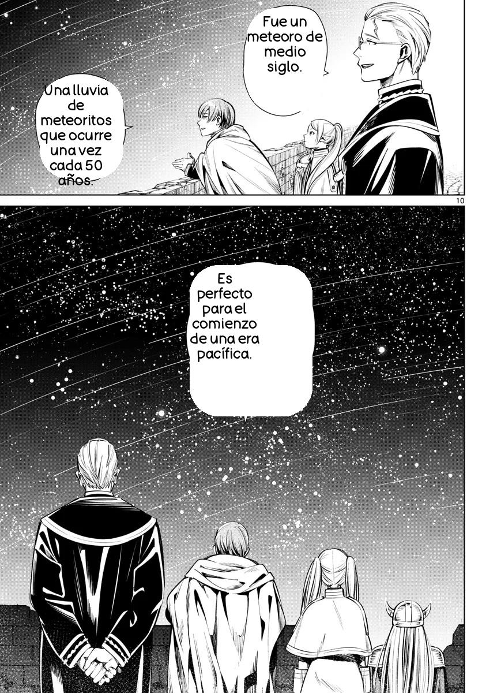

    

# MOJI
MOJI is a project aimed at enhancing the reading experience of Japanese mangas for Spanish speakers. Utilizing advanced Machine Learning techniques, MOJI tackles key challenges such as text segmentation in images, optical character recognition (OCR) to extract text from manga pages, translation of the text into Spanish, image cleaning, and reinsertion of the translated text into the image.

## Project Development

Segmentation Model: With Roboflow's assistance, an image segmentation model was trained to identify text, using a dataset of 500 Japanese manga images, which contained 4,028 annotations divided into two classes: text_bubble and text_free. More information is available at Roboflow's Universe.

OCR Model: Due to the time constraint for the project development (8 days), the specialized library [Manga OCR](https://github.com/kha-white/manga-ocr) was used.

Text Translation: For translating the text obtained via OCR, the [deep-translator](https://github.com/nidhaloff/deep-translator) library was utilized.

Cleaning and Reinsertion of Translated Text: Thanks to [Pillow](https://pypi.org/project/pillow/) and [OpenCV](https://pypi.org/project/opencv-python/) libraries, it was possible to perform image cleaning and reinsertion of the translated text.

## Results

### Original Image

### Translated Image

## Credits

MOJI uses the following libraries and resources:

**manga-ocr**: For Japanese character recognition.
**deep_translator**: For automatic translation.

And other Python libraries specified in the requirements.txt file.

Developers of these libraries are thanked for their contributions.

## Colaboradores
MOJI has been developed and maintained by the following contributors:

- [Carolina Parra](https://github.com/cparran)
- [Felipe Stuardo](https://github.com/felipe-stuardo)
- [Sara Arancibia](https://github.com/sarabarancibiag)
