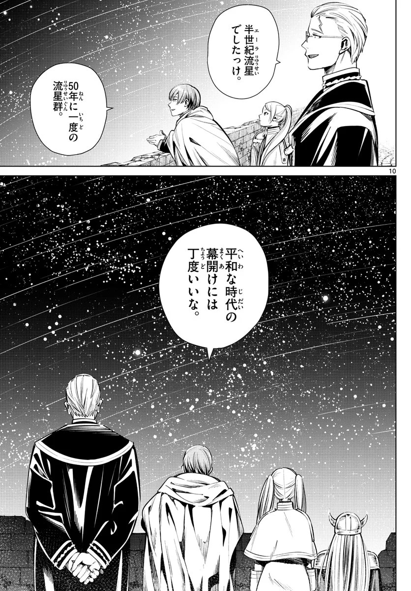
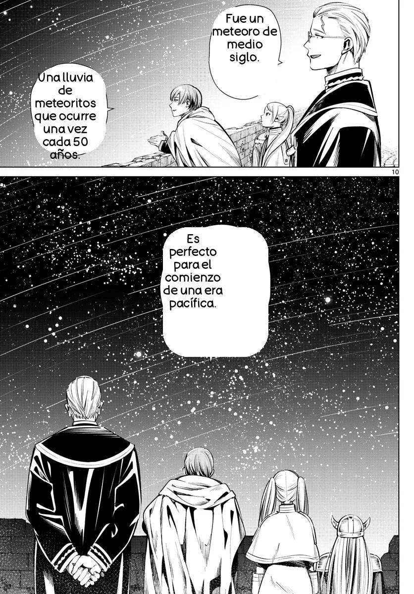

    

# MOJI
MOJI es un proyecto que tiene el ambicioso objetivo de facilitar la experiencia de lectura de mangas japoneses para hablantes de español. Basado en técnicas avanzadas de Machine Learning, MOJI aborda los siguientes desafíos clave: segmentación de texto en imagen,  reconocimiento óptico de caracteres (OCR) para extraer texto de páginas de manga traducción del texto al español, limpieza de la imagen y reinserción del texto traducido en la imagen. 

## Desarrollo del Proyecto

Modelo de segmentación: Con ayuda de Roboflow se entrenó un modelo de segmentación de imagenes en que se identifica texto. Se empleó un dataset compuesto por 510 imágenes de páginas de manga en japonés, en las cuáles se identificaron 4,028 anotaciones distribuídas en dos clases: text_bubble y text_free. Más información disponible en https://universe.roboflow.com/moji-znju4/.manga-text-detection

Modelo OCR: Dado el límite de tiempo asignado para el desarrollo del projecto (8 días), se empleó la librería especializada [Manga OCR](https://github.com/kha-white/manga-ocr).

Traducción de texto: Para la traducción del texto obtenido vía OCR, se utilizó la librería [deep-translator](https://github.com/nidhaloff/deep-translator).

Limpieza y reinserción del texto traducido: Gracias al uso de las bibliotecas [Pillow](https://pypi.org/project/pillow/) y [OpenCV](https://pypi.org/project/opencv-python/), fue posible realizar limpieza de imagen y reinserción del texto traducido.

## Resultados

### Imagen Original

### Imagen Traducida

## Créditos

MOJI utiliza las siguientes bibliotecas y recursos:

**manga-ocr**: Para el reconocimiento óptico de caracteres en japonés.

**deep_translator**: Para la traducción automática.

Y otras librerías python especificadas en el archivo [requirements.txt](requirements.txt)

Se agradece a los desarrolladores de estas bibliotecas por sus contribuciones.

## Colaboradores
MOJI ha sido desarrollado y mantenido por los siguientes colaboradores:

- [Carolina Parra](https://github.com/cparran)
- [Felipe Stuardo](https://github.com/felipe-stuardo)
- [Sara Arancibia](https://github.com/sarabarancibiag)
